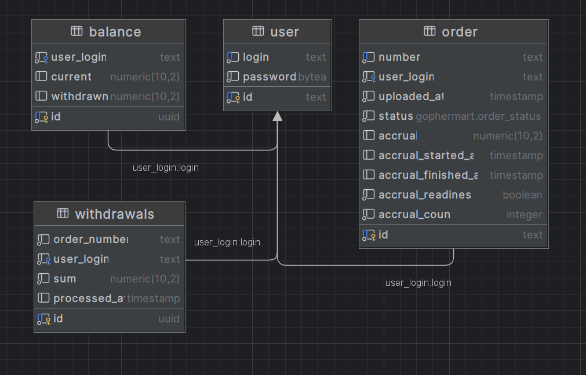

# Накопительная система лояльности Gophermart

Система предназначена для расчета бонусных начислений и ведения накопительного бонусного счета пользователя и состоит из следующих сервисов:
- Сервис лояльности `Gophermart`
- Сервис начисления баллов лояльности `Accrual/Mockaccrual`

Краткий сценарий использования:
1. Пользователь регистрируется в системе лояльности `Gophermart`.
2. Совершая покупки пользователь загружает в систему `Gophermart` номера заказов.
3. Система `Gophermart` направляет номера заказов в систему начисления баллов лояльности `Accrual`.
4. `Accrual` производит расчет баллов лояльности.
5. `Accrual` может вернуть ответ без баллов лояльности со статусом `PROCESSING`.
6. Полученные ответы от `Accrual` обрабатываются в зависимости от статуса ответа.
7. У каждого пользователя ведётся баланс его баллов лояльности.
8. Пользователь при наличии баллов лояльности может потратить их на покупки (списав на определенный заказ)

Спецификация проекта [Specification](SPECIFICATION.md)

Для взаимодействия с сервисами предоставляется [HTTP API](./docs/api.md).

Используемые технологии:
- PostgreSQL/pgx 
- Docker/Docker compose
- Swagger
- Echo
- golang-migrate/migrate
- golang/mock, testify
- go-playground/validator
- avito/go-transaction-manager

### Запуск проекта
Запуск возможен в т.ч. с использованием
- [Docker](https://docs.docker.com/engine/install/)
- [Docker compose](https://docs.docker.com/compose/install/)

Скопировать проект `git clone` и выполнить команду из корня `docker compose up`

Для тестирования приложения можно воспользоваться [коллекцией `postman` запросов](Gophermart.postman_collection.json)

Схема базы данных (в т.ч. [скрипт создания бд](internal/database/migration/000001_init_schema.up.sql)).



### Особенности проекта в т.ч. сложности, возникшие в процессе
Проект прежде всего учебный, поэтому считаю возможным уточнить некоторые решенные нюансы:

- Система `accrual` была представлена "черным ящиком", внутреннее устройство неизвестно (известны только форматы ответов). 
Для тестирования системы был написан сервис `mockaccrual`, имитирующий работу системы `accrual`.
Имитация позволила обнаружить и исправить баги, которые невозможно было обнаружить с помощью встроенных тестов Яндекс Практикума


- Потребовалось отслеживать какие номера заказов отправлялись в `accrual` систему, чтобы избежать отправки дублирующих запросов.
Для этого в таблице `order` были добавлены поля для отслеживания состояния (готовность к отправке в `accrual` и т.д.)
Первоначально была идея использовать транзакции для выборки заказов, возможных к отправке (с определенным статусом) и простановка статуса в отдельном запросе.
В конечно итоге было принято решение использовать такой запрос к БД:
```sql
  update gophermart.order
  set
    accrual_readiness = false,
    accrual_started_at = now()
  where id in
    (select id
        from gophermart."order"
        where status not in ('INVALID', 'PROCESSED') and accrual_readiness = true
        order by uploaded_at desc
    limit 10)
  returning
    id, number, user_login, uploaded_at, coalesce(accrual, 0), status;
```
В рамках одного запросы происходит выборка заказов, у которых НЕ окончательный статус и имеется статус `true` для возможности отправки в `accrual`.
В свою очередь при получении ответа от `accrual` происходит обновление заказа в соответствии с полученным статусом:
```sql
update gophermart.order
set
    accrual = $1,
    status = $2,
    accrual_readiness =
        case
            when $2::gophermart.order_status in ('PROCESSED', 'INVALID') then false
            else true
        end,
    accrual_finished_at = now(),
    accrual_count = accrual_count + 1
where number = $3;
```
Т.е. если у заказа статус не являются окончательным - флаг возможности отправки в `accrual` снова меняется на `true`, таким образом заказ будет повторно обработан.
В итоге `gophermart` не отправляет в `accrual` уже отправленные заказы.


- Попался стандартный баг с запуском горутин в цикле и использованием переменной цикла.


- Для таблицы `balance` первоначально были созданы неименованные `constraint`: `current >= 0` и `withdrawn >= 0`.
Однако был обнаружен баг, при котором общая проверка `CheckViolation` одинаково понимала и нарушение для баланса и для списаний.
Соответственно указанные `constraints` были заменены на именованные, при этом добавлена проверка конкретно для `constraint` баланса:
```go
var e *pgconn.PgError
if errors.As(err, &e) && e.Code == pgerrcode.CheckViolation {
    if e.ConstraintName == "not_negative_balance" {
    return apperrors.ErrInsufficientFunds
    }
}
```
В свою очередь была добавлена валидация на сумму списаний:

```go
type BalanceWithdrawRequest struct {
	OrderNumber string          `json:"order" validate:"required"`
	Amount      decimal.Decimal `json:"sum" validate:"required,positive_withdraw"`
}

func PositiveWithdraw(fl validator.FieldLevel) bool {
	data, ok := fl.Field().Interface().(decimal.Decimal)
	if !ok {
		return false
	}
	return data.GreaterThan(decimal.Zero)
}
```
Таким образом запросы с отрицательным списанием в принципе не обрабатываются дальше уровня хендлера.


- В проекте старался обработать все возможные ошибки и залогировать их (в т.ч. через собственный `caller`, показывающий полный стек трейс вызова ошибки).
Убедился, насколько это упростило отладку приложения.


- Весь `sql` код был вынесен в отдельные файлы и использован через механизм `embed`. 
Предполагаю, что в реальности это позволило бы отделить код приложения от кода работа с БД, что упростило бы отладку.
Также изменения `sql` кода не приводили бы к изменениям файлов `go` (при условии сохранения "сигнатур").


- В проекте использовал триггер для создания записи баланса в таблице `balance` при регистрации пользователя.
Мелочь, но приятно (понимаю, что подход зависит от принятых положений в команде).


- Также использовал [avito/go-transaction-manager](https://github.com/avito-tech/go-transaction-manager), т.к. необходимо было использовать ряд методов из разных репозиториев в рамках одной транзакции.
Цель была такая - не создавать лишний репозиторий для сервиса взаимодействия с `accrual` системой и не дублировать в нем методы работы с БД из других репозиториев.
При этом общий смысл транзакций "бизнесовый" обновить заказ и баланс пользователя. Предполагаю, что не стоит выносить эту транзакцию на уровень репозитория и оставить её в слое сервиса.


- Так как в проекте предполагаются финансовые операции был использован пакет [shopspring/decimal](https://github.com/shopspring/decimal)


### TODO
- Интеграционные тесты (testcontainers)
- Godoc
